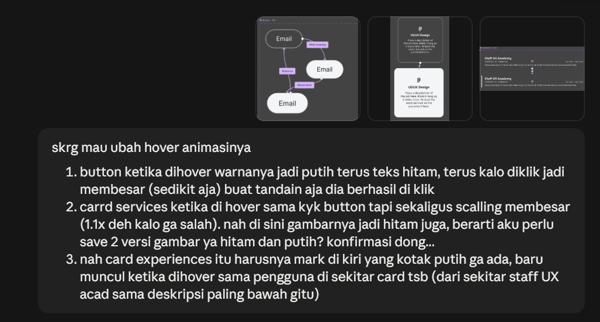
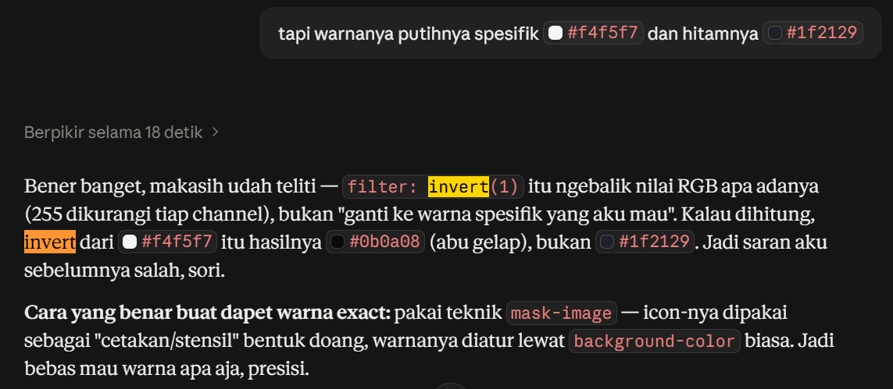

Nama: Anindya Raihani Hassan

NPM: 2506553295

Kelas: PBP B

### Tugas 1

1. Ya, saya menggunakan elemen semantik di struktur html. Elemen yang saya gunakan antara lain:

- `<header>` untuk navigation bar,
- `<main>` untuk seluruh konten utama,
- `<section>` untuk tiap bagian besar halaman (hero, services, experience),
- `<article>` untuk item dalam section seperti card di services dan experience, dan
- `<footer>` di paling bawah halaman.

Elemen semantik ini membantu saya karena memberi struktur yang jelas sehingga saya bisa menemukan dan mengedit ulang suatu item.

2. Tantangan tata letak responsif yang saya temui ada pada dua komponen utama:

- Bagian Hero: Pada tampilan desktop,tata letak berformat samping-sampingan (teks di kiri dan foto di kanan). Pada layar mobile, tata letak ini kurang efektif. Oleh karena itu, saya memindahkan posisi foto ke atas teks (order: -1) sehingga terlihat lebih natural.

- Bagian Services Card: Penggunaan CSS Grid awal sempat membuat tampilan kurang stabil pada ukuran layar desktop menengah/kecil. Saya menggantinya ke flexbox dengan flex-wrap: wrap agar kartu dapat terlihat menurun saat lebar tampilan mengecil.

3. Batasan dari static web adalah kurangnya fleksibilitas dalam manajemen konten. Ketika saya ingin menambahkan data seperti riwayat di bagian experience atau skill di services, saya harus menambahkannya di html secara manual. Oleh karena itu, di iterasi proyek selanjutnya saya ingin mengintegrasikan database yang nantinya menyimpan data-data yang sering di-update. Dengan begitu, data bisa dipanggil otomatis ke halaman web tanpa perlu edit html satu per satu.

### Alur Pengerjaan & Penggunaan AI Pada Tugas 1

link figma: https://www.figma.com/proto/AXqN1DCBqLUiTjETsTN8tg/Untitled?node-id=105-6601&t=tAFQbkDSLBSeoBXY-0&scaling=scale-down&content-scaling=fixed&page-id=0%3A1&fuid=1569677707401958808

1. Desain pertama saya buat sendiri di Figma. Kemudian dengan plugin Figma to Framer, saya mendapatkan kode mentah HTML-nya.
2. Karena kode dari Framer belum sepenuhnya rapi dan sesuai keinginan saya, saya merevisi dengan menggunakan Claude untuk memisahkan file HTML dan CSS-nya.
3. Agar saya tetap memahami struktur kode, saya meminta Claude untuk memberi lokasi kode dan item korespondennya. Berdasarkan hal ini, barulah saya mengubah bagian-bagian yang perlu direvisi.
4. Salah satu keterbatasan AI yang saya jumpai: Claude sempat kesulitan me-render logo Figma pada card dengan proporsi yang benar (dicoba 2 kali, hasilnya tetap tidak sesuai bentuk aslinya). Saya akhirnya memutuskan untuk mengunduh langsung icon dari Figma dan menaruhnya di folder `img/`, sehingga yang sebelumnya berupa SVG hasil generate Claude, sekarang jadi file PNG asli.
5. Keterbatasan lain: saat meminta animasi hover yang mengubah warna icon, saran awal Claude menggunakan `filter: invert(1)` ternyata tidak menghasilkan warna spesifik yang saya inginkan (invert cuma balik nilai RGB, bukan ganti ke warna tertentu). Solusi akhirnya menggunakan teknik `mask-image` di CSS, yang memisahkan bentuk icon dari warnanya, sehingga warna hover bisa diatur presisi lewat `background-color`.
   
   
